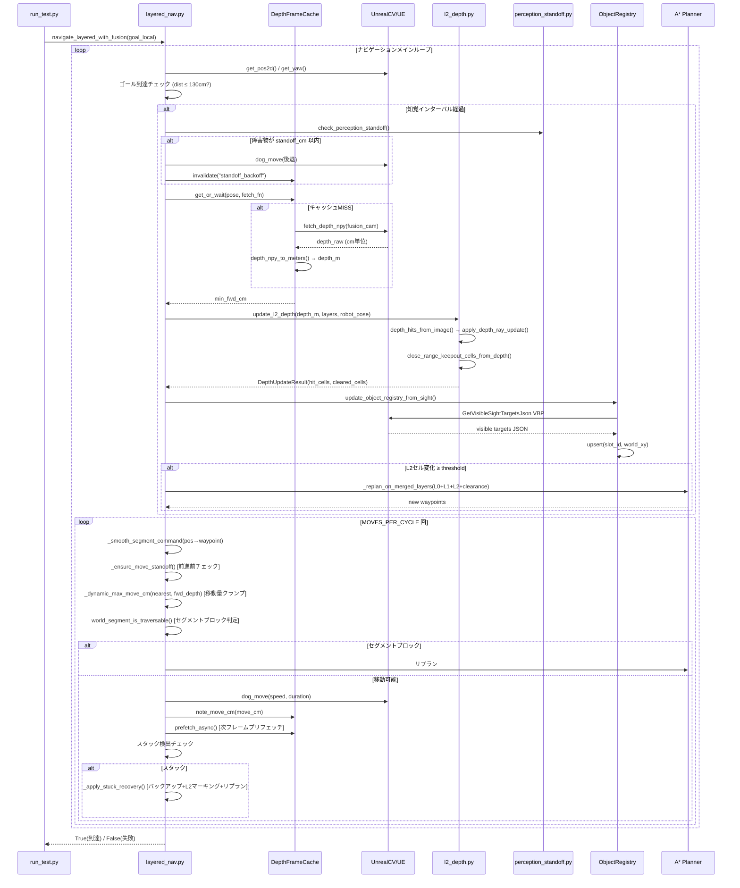

# SimWorld `site_transport_20m` ミッション実行アーキテクチャ 詳細解説

---

## 1. エントリポイントとオーケストレーション

### `run_test.py` — ミッション制御の司令塔

`run_test.py` がこのシナリオ全体のエントリポイントです。`main()` 関数がミッション全体を順次制御します。

#### CLIフラグ

| フラグ | 意味 |
|---|---|
| `--l0` | L0 NavMesh マスクPNGのパス（デフォルト: `L0_MASK_STRICT`） |
| `--skip-spawn` | シーンのスポーンをスキップ（再実行時に使用） |
| `--spawn-only` / `--plan-only` | デバッグ用部分実行 |
| `--max-nav-steps` | ナビゲーション最大ステップ数（デフォルト: 600） |
| `--l2-mode {sight,geom,camera,off}` | L2知覚のモード（デフォルト: `sight`） |
| `--no-l2` | L2無効（`--l2-mode off` のエイリアス） |
| `--no-l1` | L1禁止ゾーンを無効化 |
| `--profile {default,careful,fast}` | NavProfile の選択 |
| `--run-label` / `--trial-index` | アーティファクトのラベリング（例: `L0L2_fast_150cm_1`） |

#### ミッションフェーズと Leg 構造

```
[起動] → SpotDog スポーン → NavQueryService確立 → Leg1: Start → Material → [キャリー取得] → Leg2: Material → Humanoid → [配送]
```

1. **スポーン**: `spawn_site_transport_scene()` でシーンを初期化。SpotDogを開始位置に配置
2. **Leg1 (`navigate_to_slot`)**: SpotDogが資材（shipping crate）へ接近。`registry.material_actor_name` をslot_idとして使用
3. **キャリー取得 (`begin_carry_from_material`)**: 資材をロボットの背中に取り付け（UEボーンアタッチまたはPython同期）
4. **Leg2 (`deliver_to`)**: Humanoidに向かって配送。`carry_sync_name` で資材位置を同期
5. **配送 (`deliver_carry_at_humanoid`)**: 資材をHumanoidの足元にアニメーション移動して完了

#### アーティファクトのラベリング

`--run-label L0L2_fast_150cm --trial-index 3` と指定すると、出力ファイルが `costMap_L0L2_fast_150cm_3.png`、`metricsSummary_L0L2_fast_150cm_3.json` などの固定名で保存されます。ラベルなしの場合は UTC タイムスタンプ（`20240101T120000Z`）が使われます。

---

## 2. ナビゲーションスタック（レイヤー構造）

### L0: 静的 NavMesh（ベースレイヤー）

`crop_l0_to_local_region()` (`l0_crop.py`) により、フルマップの NavMesh PNGから現在のシナリオ領域（`REGION_SIZE_CM` × `REGION_SIZE_CM`）だけを切り出して `LayeredCostmap` の L0 レイヤーとして設定します。

- 壁・構造物・NavMesh外の永続的な障害物を表現
- 不変：ミッション中に書き換えられない
- A* プランニングの「床」として機能

### L1: 禁止ゾーン（セマンティックレイヤー）

`apply_forbidden_zones_l1(layers, registry.forbidden_zones)` (`zones.py`) により、プロップ配置情報から「人が立ち入るべきでない矩形領域」をL1レイヤーにラスタライズします。

- `--no-l1` フラグで無効化可能
- NavProfile の `enable_l1_by_default` で制御（`fast` / `default` ともに `True`）
- ラスタライズ後は L0 と同様に不変

### L2: 動的障害物（センサーレイヤー）

L2レイヤーはナビゲーション中にリアルタイムで更新される唯一のレイヤーです。

**現在の実装: `l2_depth.py` (`update_l2_depth`)**

- カメラの深度画像から障害物セルを直接 L2 に書き込む
- `depth_hits_from_image()` → `apply_depth_ray_update()` でレイキャスト更新
- 2回以上検出されたセルは `l2_static_latch` でラッチ（永続化）
- ログオッズ更新（`use_log_odds=True`）で誤検知を抑制
- 近接障害物（100cm以内）は `close_range_keepout_cells_from_depth()` でキープアウトゾーン設定

**旧実装: `l2_sight.py`（サイトペインティング方式）**

- AI Sight の検出結果を距離・ベアリングから座標変換してL2に書き込む方式
- 現在は `object_registry.py` が担う「セマンティック情報管理」に分離された

**なぜL2をDepth専用にしたか**: AI Sightは「見えているかどうか」のブール情報であり、遮蔽物の精密な形状をL2に書き込むには深度画像の方が適切。また、AI Sightはゴール位置の追跡（ObjectRegistry）に専念させることで関心の分離が実現された。

### `ObjectRegistry` — セマンティックゴール管理

`object_registry.py` の `ObjectRegistry` クラスは**L2コストマップには一切書き込まない**。

- AI Sightの可視ターゲット一覧（`GetVisibleSightTargetsJson` VBPコマンド）を解析
- 各オブジェクトの `slot_id` → ワールド座標 (`last_world_xy`) のマッピングを管理
- `goal_xy(slot_id)` でナビゲーションゴール座標を提供
- 動的オブジェクト（`human_worker`）は視野外に出たときに自動エビクト
- 静的プロップはPlacementRegistryから初期化されるため、見えていなくても座標を保持

**なぜRegistryを分離したか**: ゴール座標の更新（Sightで追跡）と障害物マップの更新（Depthで塗布）を独立して行うことで、Sightが使えない環境でもDepthだけでナビゲーションが機能し、逆にSightフォールバックで幾何学的推定に切り替えられる。

### `layered_nav.py` — メインループ

`navigate_layered_with_fusion()` が 1 ミッションレグの全ナビゲーションを担当します。メインループ構造：

```
while total_steps < max_total_steps:
    1. ロボット姿勢取得 (pos_xy, yaw_deg)
    2. ゴール到達判定 (dist <= tolerance_cm → return True)
    3. 知覚間隔チェック → _run_perceive_cycle() [perception_interval_s ごと]
    4. MOVES_PER_CYCLE 回の移動:
       a. ウェイポイント選択・到達チェック
       b. スタンドオフチェック → 必要なら後退
       c. セグメントコマンド生成 (_smooth_segment_command)
       d. 移動前セグメントブロック判定 → ブロック時はリプランorスタック回復
       e. open-loop移動実行 (_execute_segment_command)
       f. スタック検出 → _apply_stuck_recovery
```

---

## 3. 知覚パイプライン

### AI Sight → ObjectRegistry（セマンティック経路）

```
UE AI Perception Controller
    ↓ GetVisibleSightTargetsJson VBP
fetch_ue_sight_targets() [object_registry.py]
    ↓ parse & resolve
update_object_registry_from_sight()
    ↓
ObjectRegistry.upsert(slot_id, world_xy) [ゴール座標のみ更新]
```

- 毎回の知覚サイクルで呼ばれるが、`sight_registry_every_n` パラメータで間引き可能（fastプロファイル: 2回に1回）
- フォールバック: UE Sightが使えない場合は幾何学的なFOV判定（`_fallback_visible_targets`）

### FusionCam Depth → L2 occupancy（障害物経路）

```
UnrealCV FusionCamera
    ↓ fetch_depth_npy() [depth_object_perception.py]
DepthFrameCache.get_or_wait()
    ↓ depth_npy_to_meters() [単位変換]
update_l2_depth() [l2_depth.py]
    ↓
depth_hits_from_image() → apply_depth_ray_update()
close_range_keepout_cells_from_depth()
    ↓
LayeredCostmap.l2 更新
```

#### `DepthFrameCache` — フレームキャッシュ (`depth_frame_cache.py`)

1回の深度フェッチは重い（カメラ移動 + UE tick待機）ため、以下の条件でキャッシュを再利用します：

- **TTL**: `ttl_s` 以内（デフォルト 0.3s、fast: 0.55s）
- **姿勢デルタ**: ロボットが `pose_delta_max_cm` 以上移動していない（デフォルト 5cm、fast: 12cm）
- **移動無効化**: `move_invalidate_cm` 以上の移動でキャッシュ破棄（デフォルト 30cm、fast: 120cm）
- **プリフェッチ**: 移動完了直後に次フレームをウォームアップ（`depth_prefetch_fn`）

#### `perception_standoff` — L2書き込みゲート

深度撮影の前に `check_perception_standoff()` でロボットが障害物から十分離れているか確認します：

- `standoff_cm`（fastプロファイル: 100cm）以内に障害物がある場合は後退
- 後退後の深度フレームキャッシュは自動失効
- **「立体的に近すぎる = 深度画像が壊れる」**という実装上の制約が設計の理由

#### depth_npy_to_meters — 深度単位の扱い (`depth_object_perception.py`)

UEの深度バッファはピクセル値がcmで入ることがある（UnrealCV実装依存）。`depth_npy_to_meters()` と `depth_npy_unit_hint()` が自動で単位を検出し、常にメートル換算に正規化します。fastプロファイルでの `min_obstacle_height_cm=55cm` はSpotDogの脚がノイズとして誤検知されないための閾値です。

---

## 4. プランニングと移動

### コストマップフュージョン

プランニング時は常に `_planning_costmap(layers)` を使用します：

```python
merged = max(L0, L1, L2)  # 3層を max で合成
+ 「障害物から planning_clearance_cm 以内のセルに SITE_PLANNING_CLEARANCE_COST=300 を付加」
```

`planning_clearance_cm` はNavProfileで設定：
- デフォルト: 100cm
- fast: **150cm**（より広いクリアランスで保守的なルートを計算）

### A* リプランの連鎖

`_safe_replan_astar()` は以下の順でリプランを試みます：

1. `merged + clearance` コストマップ
2. `merged`（clearanceなし）
3. `L0 + L1`（L2を無視）
4. `L0`のみ（最後の手段）

L2リプランのトリガー：
- L2更新でセル差分が `L2_REPLAN_CELL_DELTA_THRESHOLD` 以上（fast: 10セル）
- セグメントが移動前チェックでブロックされた
- 進捗退行（`PROGRESS_REGRESS_THRESHOLD_CM = 350cm`）検出
- スタック回復時

### Open-Loop移動とスタンドオフ/バックオフ

SpotDogの移動はすべて open-loop（「N cm進め、M度回転せよ」を送って待つ）です：

```python
# _smooth_segment_command: 向き差 > 35° → turn-only, 12°-35° → turn+move, <12° → move-only
command = _smooth_segment_command(pos_xy, yaw_deg, waypoint_xy)

# 障害物が近い場合は移動量を動的に縮小
allowed_move = _dynamic_max_move_cm(nearest_dist_cm, forward_depth_cm)
# → 220cm以上: 120cm(fast: 250cm), 100-220cm: 140cm, 50-100cm: 70cm, <50cm: 35cm
```

#### スタック検出と回復

`STUCK_CHECK_MOVES = 4` 回の移動で `STUCK_MOVE_THRESHOLD_CM = 14cm` 以下の変位しか得られない場合にスタックと判定：

1. 現在位置の周囲に L2 lethal セルをマーク（障害物とみなす）
2. `UNSTUCK_BACKUP_CM = 100cm` バックアップ
3. エスケープ候補を探してコスト最小の方向へ短距離移動
4. 失敗を重ねると `MAX_UNSTUCK_ATTEMPTS = 16` でラストリゾート（L2全フラッシュ）に移行

---

## 5. ミッション固有ロジック

### SpotDog ロボット

`level_nav_robot.py` の `find_spotdog_actor()` でUE内のSpotDogアクターを特定します。起動時に：
- `ensure_robot_upright_at_start()`: 転倒していたら復帰
- `verify_spotdog_at_start()`: 開始位置確認
- `prepare_spotdog_mission_start()`: AIコントローラー有効化

### Start → Materials → Humanoid のゴール選択

```python
# Leg1ゴール: ObjectRegistry.goal_xy(material_actor_name) → フォールバックでPlacementRegistry座標
material_xy = _material_goal_xy(registry)
# → registry.transport_slot().world_xyz_cm があれば優先（動的に更新された座標）
# → なければ lc.local_xy_to_world(*registry.material_pickup_local_cm)

# Leg2ゴール: ObjectRegistry.goal_local(humanoid_actor_name)
# → Humanoidは is_dynamic=True なので、見えた時点で座標が更新される
```

### キャリー/デリバー状態

`carry.py` が資材の「持ち運び」を担当します：

**`begin_carry_from_material()`**:
1. 資材アクター（shipping crate）をマップ外に退避（`_hide_actor_offmap`）
2. CarryActorをロボット背部座標にスポーン・アニメーション移動
3. `attach_carry_to_robot_bone()` でUEスケルタルソケットにアタッチ
4. アタッチ不可の場合は Python レベルで `sync_carry_pose()` を毎ステップ呼び出し

**`deliver_carry_at_humanoid()`**:
1. `detach_carry_from_robot_bone()` でデタッチ
2. Humanoidの足元座標に向けてアニメーション移動
3. 最後に `_hide_actor_offmap()` で資材を非表示化
4. ロボットとHumanoidの距離が `ARRIVE_TOLERANCE_CM * 2 = 260cm` 以内であれば成功

**Leg2でのL2リセット（carry_forward）**:

```python
_reset_depth_state("leg2", carry_forward=True)
# → depth_tracker.snapshot_occupied(): 2-hitラッチされた静的障害物のみ保存
# → object_registry.clear_dynamic(): Humanoidの古い座標を削除
```

Leg1で蓄積した一時的な深度セルは捨てるが、確実に確認された静的障害物は leg2 にも引き継ぐ設計です。

---

## 6. メトリクスと出力

### `metrics.py`

#### `NavTimingAccumulator` — タイミングバケット

ナビゲーションループの各フェーズにかかった時間をミリ秒単位で蓄積します：

| バケット | 内容 |
|---|---|
| `perceive_ms` | 知覚サイクル全体（depth_fetch + l2_update + sight_registry） |
| `move_ms` | 実際の移動・回転コマンド送信時間 |
| `replan_ms` | A* リプランニング時間 |
| `settle_ms` | `tick_settle()` の待機時間 |
| `standoff_ms` | スタンドオフ・バックオフ処理時間 |
| `depth_refresh_ms` | 知覚サイクル外での深度更新時間 |
| `pose_query_ms` | ロボット姿勢クエリ時間 |
| `loop_overhead_ms` | ループの残余オーバーヘッド |

#### `MissionRecorder` — ミッション全体のメトリクス

各ナビゲーションステップで `record_pose()` を呼び出し、以下を計測：
- 速度違反（5 km/h 超え）
- 禁止ゾーン侵入時間
- オブジェクト近接違反（1m 以内）

#### `save_metrics_json` / `save_timing_json` の命名

```
metricsSummary_{run_label}_{trial_index}.json  ← --run-label / --trial-index 指定時
site_transport_metrics_{stamp}.json             ← ラベルなし時
timing_{run_label}_{trial_index}.json
```

### `viz.py` — アーティファクト出力

`save_site_transport_artifacts()` が以下を生成：

| ファイル | 内容 |
|---|---|
| `costMap_{suffix}.png` | L0/L1/L2 コストマップ重ね合わせ + 軌跡 + 計画パス + L2推定位置 |
| `metricsSummary_{suffix}.png` | ステータスバナー + タイミングブレークダウンテーブル + 違反グラフ |
| `metricsSummary_{suffix}.json` | 全メトリクス（JSON） |
| `timing_{suffix}.json` | タイミングサマリー（JSON） |
| `site_transport_costmap_{suffix}.npz` | L0/L1/L2/merged の NumPy アレイ |
| `site_transport_trajectory_{suffix}.json` | 軌跡・計画パス・L2推定点 |
| `latest_*.json` | 最新実行へのシンボリックコピー |

---

## 7. データフロー図（1ナビゲーションサイクル）



---

## 8. CLIフラグ vs NavProfile 設定可能項目まとめ

### CLIで直接設定するもの
- L0マスクパス、L2モード、L1有効/無効
- `--profile` によるNavProfile選択
- 最大ステップ数、アーティファクトディレクトリ

### NavProfile（`site_transport_config.py`）で設定するもの

| パラメータ | default | fast | 意味 |
|---|---|---|---|
| `perception_interval_s` | 1.0s | **5.5s** | 知覚サイクルの最小間隔 |
| `site_robot_speed` | 180 cm/s | **285 cm/s** | 移動速度 |
| `site_max_open_loop_move_cm` | 120 cm | **250 cm** | 1回の最大移動距離 |
| `planning_clearance_cm` | 100 cm | **150 cm** | コストマップクリアランス半径 |
| `perception_standoff_cm` | 50 cm | **100 cm** | 知覚前の安全距離 |
| `l2_replan_cell_delta_threshold` | 1 セル | **10 セル** | リプランをトリガーするL2変化量 |
| `depth_move_invalidate_cm` | 30 cm | **120 cm** | この移動量でキャッシュを破棄 |
| `depth_cache_ttl_s` | 0.3s | **0.55s** | 深度キャッシュの有効期間 |
| `moves_per_cycle` | 2 | **3** | 1知覚間隔あたりの移動回数 |
| `nav_warmup_settle_s` | 4.0s | **1.0s** | ナビ開始前の安定待機時間 |

fastプロファイルは「知覚頻度を下げ、高速移動・大きなクリアランスで走り抜ける」設計で、150cmクリアランスがfast 150cmと呼ばれる理由です。

---

## 9. 設計上の重要な選択点まとめ

1. **L2をDepth専用にした理由**: AI Sightは遮蔽に敏感でノイズが多く、深度画像の方が障害物形状の精密な推定に適しているため。Sightはゴール追跡（ObjectRegistry）に特化させることで役割分担を明確化。

2. **ObjectRegistryをL2から分離した理由**: ゴール座標（Humanoidなど動的オブジェクト）は「コストマップに焼き付けるべきでない」。レジストリはあくまでプランニング目標座標の辞書であり、コストマップは障害物のみを扱う。

3. **Open-Loop移動の採用理由**: UnrealCVのSpotDogはNavMesh追従ではなく直接モーション制御（`Move_Speed`, `Rotate_Angle` VBP）で動くため、Open-Loopが必然的選択。姿勢フィードバックはUEからのポーリングで補う。

4. **DepthFrameCacheの設計理由**: 深度フェッチ（カメラ移動→tick待機→画像取得）は1回100-300msかかる。1ナビループで複数回使う（スタンドオフチェック、L2更新、前進前チェック）ため、TTL+姿勢ゲートのキャッシュで無駄なフェッチを排除。

5. **Carry-Forwardマスクの理由**: Leg2でL2を完全リセットすると、Leg1で確認した静的障害物の情報が失われる。2-hitラッチされた（十分な証拠がある）セルだけを引き継ぐことで、ファントム消去と信頼できる障害物保持のバランスをとる。

---

## 要約

site_transport_20m ミッション実行アーキテクチャの中核は以下の3点です：

- **3層コストマップ構造**（L0静的NavMesh / L1禁止ゾーン / L2深度SLAM）がナビゲーションの基盤で、A*は常に3層を `max` 合成したうえに `planning_clearance_cm` のソフトコストを乗せて計算します
- **ObjectRegistryはコストマップに書かない**という設計が重要で、Sightはゴール座標追跡専用、Depthは障害物マップ専用に役割分担しています
- **fastプロファイル（150cm）**は、知覚頻度を1/5.5秒に下げ・速度285cm/sに上げ・クリアランスを150cmに広げることで「周りを見ながらゆっくり」ではなく「大きく避けながら速く走る」戦略を取ります
- **DepthFrameCache**がTTL・姿勢ゲート・移動無効化の3条件でキャッシュを管理し、重い深度フェッチを1ループに最小限に抑えています
